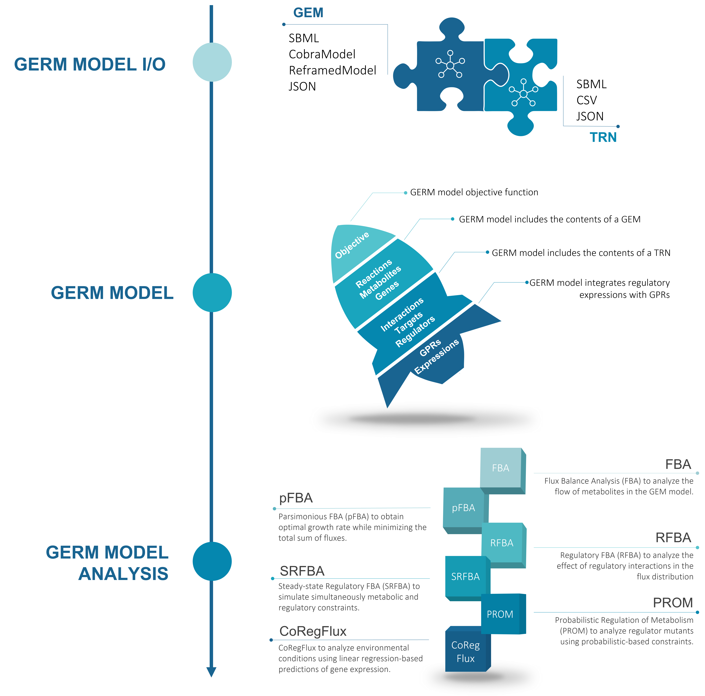

# GERM models and analysis

MEWpy supports the integration of regulatory and metabolic models at the genome-scale. 
All tools required to build, simulate, and analyze GEnome-scale Regulatory and Metabolic (GERM) models 
are available in the `mewpy.germ` module.

A GERM model includes a standard Genome-Scale Metabolic (**GEM**) model. 
The GEM model comprehends reactions (w/ GPRs), metabolites and genes. 
It also includes exchange reactions defining the environmental conditions of the system.
In addition, GERM models include Transcriptional Regulatory Networks (**TRNs**). 
A TRN comprehends interactions (w/ boolean algebra expressions), target genes and regulators. 
It also includes external stimuli (effectors), regulatory metabolites, and regulatory reactions.
GEM models and TRNs are often linked by the target genes of the TRN and the genes of the GEM model.

MEWpy supports several methods to perform phenotype simulations using integrated GERM models.
The following simulation methods are available in **`mewpy.germ.analysis`** module:
- **`FBA`** - Metabolic model only
- **`pFBA`** - Metabolic model only
- **`RFBA`** - Regulatory-Metabolic model
- **`SRFBA`** - Regulatory-Metabolic model
- **`PROM`** - Regulatory-Metabolic model
- **`CoRegFlux`** - Regulatory-Metabolic model



## Reading GERM models
In this example, we will be using the integrated _E. coli_ core model published by 
[Orth _et al_, 2010](https://doi.org/10.1128/ecosalplus.10.2.1).

_E. coli_ integrated model is available in two separate files:
- metabolic model _examples/models/germ/e_coli_core.xml_
- regulatory model _examples/models/germ/e_coli_core_trn.csv_

To assemble an integrated GERM model, we use `mewpy.io.read_model` function. 
This function accepts multiple readers having different engines.
MEWpy contains the following engines that can be used in the `Reader` object:
- `BooleanRegulatoryCSV` - reads a TRN from a CSV file - regulatory interactions: `target, (regulator1 and regulator2)` 
- `CoExpressionRegulatoryCSV` - reads a TRN from a CSV file - regulatory interactions: `target, co-activator1 co-activator2, co-repressor2`
- `TargetRegulatorRegulatoryCSV` - reads a TRN from a CSV file - regulatory interactions: `target, regulator1`
- `RegulatorySBML` - reads a TRN from a SBML file using the SBML-QUAL plugin
- `MetabolicSBML` - reads a GEM from a SBML file
- `CobraModel` - reads a GEM from a COBRApy model
- `ReframedModel` - reads a GEM from a Reframed model
- `JSON` - reads a GERM model from a JSON file

In addition, the `Reader` accepts other arguments such as the `filename`, `sep`, among others.

```python
from mewpy.io import Reader, Engines, read_model

# a reader for the E. coli core GEM model
gem_reader = Reader(Engines.MetabolicSBML, 'e_coli_core.xml')

# a reader for the E. coli core TRN model
# (it accepts specific parameters for reading the TRN CSV file)
trn_reader = Reader(Engines.BooleanRegulatoryCSV, 'e_coli_core_trn.csv',
                    sep=',', id_col=0, rule_col=2, aliases_cols=[1], header=0)

# reading the integrated regulatory-metabolic model
model = read_model(gem_reader, trn_reader)
model
```
<table>
<tr><th><b>Model</b></th><td>e_coli_core</td></tr><tr><th>Name</th><td>E. coli core model - Orth et al 2010</td></tr><tr><th>Types</th><td>regulatory, metabolic</td></tr><tr><th>Compartments</th><td>e, c</td></tr><tr><th>Reactions</th><td>95</td></tr><tr><th>Metabolites</th><td>72</td></tr><tr><th>Genes</th><td>137</td></tr><tr><th>Exchanges</th><td>20</td></tr><tr><th>Demands</th><td>0</td></tr><tr><th>Sinks</th><td>0</td></tr><tr><th>Objective</th><td>Biomass_Ecoli_core</td></tr><tr><th>Regulatory interactions</th><td>159</td></tr><tr><th>Targets</th><td>159</td></tr><tr><th>Regulators</th><td>45</td></tr><tr><th>Regulatory reactions</th><td>12</td></tr><tr><th>Regulatory metabolites</th><td>11</td></tr><tr><th>Environmental stimuli</th><td>0</td></tr>
</table>

Although `mewpy.io.read_model` function is the preferred interface for reading models, MEWpy contains other read/write methods available at `mewpy.io`.

## Working with GERM models

A GERM model contains the following **metabolic** information:
- `objective` - variable/coefficient dictionary
- `reactions` - identifier/reaction dictionary
- `metabolites` - identifier/metabolite dictionary
- `genes` - identifier/gene dictionary
- `gprs` - identifier/GPR expression dictionary
- `compartments` - identifier/compartment dictionary
- `exchanges` - identifier/reaction dictionary
- `demands` - identifier/reaction dictionary
- `sinks` - identifier/reaction dictionary
- `external_compartment` - Compartment with most exchange reactions

A GERM model contains the following **regulatory** information:
- `interactions` - identifier/interaction dictionary
- `targets` - identifier/target dictionary
- `regulators` - identifier/regulator dictionary
- `regulatory_reactions` - identifier/reaction dictionary
- `regulatory_metabolites` - identifier/metabolite dictionary
- `environmental_stimuli` - identifier/regulator dictionary

One can inspect model attributes in Jupyter notebooks:

```python
# read E. coli core model
from mewpy.io import Reader, Engines, read_model

gem_reader = Reader(Engines.MetabolicSBML, 'e_coli_core.xml')
trn_reader = Reader(Engines.BooleanRegulatoryCSV, 'e_coli_core_trn.csv',
                    sep=',', id_col=0, rule_col=2, aliases_cols=[1], header=0)
model = read_model(gem_reader, trn_reader)
model.objective
```
    {Biomass_Ecoli_core || 1.496 3pg_c + ...
```python
model.reactions
```
    'ACALDt': ACALDt || 1.0 acald_e <-> 1.0 acald_c,
    'ACKr': ACKr || 1.0 ac_c + 1.0 atp_c <-> 1.0 actp_c + 1.0 adp_c,
    'ACONTa': ACONTa || 1.0 cit_c <-> 1.0 acon_C_c + 1.0 h2o_c,
    'ACONTb': ACONTb || 1.0 acon_C_c + 1.0 h2o_c <-> 1.0 icit_c,
    'ACt2r': ACt2r || 1.0 ac_e + 1.0 h_e <-> 1.0 ac_c + 1.0 h_c,
    'ADK1': ADK1 || 1.0 amp_c + 1.0 atp_c <-> 2.0 adp_c,
    'AKGDH': AKGDH || 1.0 akg_c + 1.0 coa_c + 1.0 nad_c -> 1.0 co2_c + 1.0 nadh_c + 1.0 succoa_c,
    ...
```python
model.interactions
```
    'b0080_interaction': b0080 || 1 = ( ~ surplusFDP),
    'b0113_interaction': b0113 || 1 = ( ~ surplusPYR),
    'b0114_interaction': b0114 || 1 = (( ~ b0113) | b3261),
    'b0115_interaction': b0115 || 1 = (( ~ b0113) | b3261),
    ...

A GERM model container is a regular Python dictionary. They can be used to access variables in the model (e.g., 
`model.reactions['MY_REACTION']`).
One can also yield variables from the model using `yield_...`-like methods, such as `model.yield_regulators()`.

```python
# get PDH reaction from the model
pdh = model.reactions['PDH']
pdh
```
<table>
<tr><th>Identifier</th><td>PDH</td></tr><tr><th>Name</th><td></td></tr><tr><th>Aliases</th><td></td></tr><tr><th>Model</th><td>e_coli_core</td></tr><tr><th>Types</th><td>reaction</td></tr><tr><th>Equation</th><td>1.0 coa_c + 1.0 nad_c + 1.0 pyr_c -> 1.0 accoa_c + 1.0 co2_c + 1.0 nadh_c</td></tr><tr><th>Bounds</th><td>(0.0, 1000.0)</td></tr><tr><th>Reversibility</th><td>False</td></tr><tr><th>Metabolites</th><td>coa_c, nad_c, pyr_c, accoa_c, co2_c, nadh_c</td></tr><tr><th>Boundary</th><td>False</td></tr><tr><th>GPR</th><td>(b0115 & b0114 & b0116)</td></tr><tr><th>Genes</th><td>b0115, b0114, b0116</td></tr><tr><th>Compartments</th><td>c</td></tr><tr><th>Charge balance</th><td>{'reactants': 6.0, 'products': -6.0}</td></tr><tr><th>Mass balance</th><td>{'C': 0.0, 'H': 0.0, 'N': 0.0, 'O': 0.0, 'P': 0.0, 'S': 0.0}</td></tr>
</table>

```python
# iterate over regulators
for regulator in model.yield_regulators():
    print(regulator)
    break
```
    b0113 || (0.0, 1.0)

---
**NOTE**

It is possible to add variables to the model dictionaries (e.g., `model.reactions['MY_REACTION'] = my_reaction`), 
but this is not recommended. The model dictionaries are used to keep track of the model variables 
and should not be modified directly.
To add or remove variables, use the `model.add()` and `model.remove()` methods documented bellow. These methods 
will perform the required updates in the model.

---

### GERM model operations
A GERM model supports the following operations:
- `get(identifier, default=None)` - It retrieves the variable using its identifier
- `add(variables)` - It adds new variables to the model; variables will be added to model containers according to their types
- `remove(variables)` - It removes variables from the model; variables will be removed from model containers according to their types
- `update(variables, objective, ...)` - It updates variables, compartments, objective, etc, in the model
- `copy()` - It makes a shallow copy of the model
- `deepcopy()` - It makes a deep copy of the model
- `to_dict()` - It exports the model to a dictionary

```python
# get the Crp regulator
crp = model.get('b3357')
crp
```
<table>
<tr><th>Identifier</th><td>b3357</td></tr><tr><th>Name</th><td>b3357</td></tr><tr><th>Aliases</th><td>b3357, Crp</td></tr><tr><th>Model</th><td>e_coli_core</td></tr><tr><th>Types</th><td>regulator, target</td></tr><tr><th>Coefficients</th><td>(0.0, 1.0)</td></tr><tr><th>Active</th><td>True</td></tr><tr><th>Interactions</th><td>b0721_interaction, b0722_interaction, b0723_interaction, b0724_interaction, b0902_interaction, b0903_interaction, b0904_interaction, b1524_interaction, b2492_interaction, b3114_interaction, b3115_interaction, b3870_interaction, b4122_interaction</td></tr><tr><th>Targets</th><td>b0721, b0722, b0723, b0724, b0902, b0903, b0904, b1524, b2492, b3114, b3115, b3870, b4122</td></tr><tr><th>Environmental stimulus</th><td>False</td></tr><tr><th>Interaction</th><td>b3357 || 1 = CRPnoGLC</td></tr><tr><th>Regulators</th><td>CRPnoGLC</td></tr>
</table>

```python
# remove the regulator from the model
model.remove(crp)
'b3357' in model.regulators
```
    False

```python
# add the regulator back to the model
model.add(crp)
'b3357' in model.regulators
```
    True

```python
# shallow copy only performs a copy of the containers
model_copy = model.copy()
print(model is model_copy)

# but variables are still the same
crp is model_copy.regulators['b3357']

# deep copy performs a copy of the containers and variables
model_copy = model.deepcopy()
crp is model_copy.regulators['b3357']
```
    False
    True
    False

```python
# export the model to a dictionary
model.to_dict()
```

A GERM model supports **temporary changes** using the `with model` context manager. 
In addition, one can manually `undo()` and `redo()` the last operations or `reset()` and `restore()` a GERM model.
    
```python
# make a temporary change to the model
pfk = model.get('PFK')

with model:
    model.remove(pfk)
    print('Is PFK in the model?', 'PFK' in model.reactions)

print('Has PFK removal been reverted?', 'PFK' in model.reactions)
```
    Is PFK in the model? False
    Has PFK removal been reverted? True

A GERM model is by default a multi-type model. This means that one can manipulate both a **metabolic** and **regulatory** model 
at the same time. Alternatively, one can manipulate a **single** regulatory or metabolic model.

MEWpy allows building single- or multi-type models easily:

```python
from mewpy.germ.models import RegulatoryModel

# creating a new regulatory model
reg_model = RegulatoryModel(identifier='my_regulatory_model')
reg_model
```
<table>
<tr><th><b>Model</b></th><td>my_regulatory_model</td></tr><tr><th>Name</th><td>my_regulatory_model</td></tr><tr><th>Types</th><td>regulatory</td></tr><tr><th>Compartments</th><td></td></tr><tr><th>Regulatory interactions</th><td>0</td></tr><tr><th>Targets</th><td>0</td></tr><tr><th>Regulators</th><td>0</td></tr><tr><th>Regulatory reactions</th><td>0</td></tr><tr><th>Regulatory metabolites</th><td>0</td></tr><tr><th>Environmental stimuli</th><td>0</td></tr>
</table>

```python
# check if the model is metabolic
reg_model.is_metabolic()
```
    False

```python
from mewpy.germ.models import Model

pfk = model.get('PFK').deepcopy()

# using types model constructor
met_model = Model.from_types(('metabolic', ), 
                             identifier='my_metabolic_model', 
                             reactions={'pfk': pfk})
met_model
```
<table>
<tr><th><b>Model</b></th><td>my_metabolic_model</td></tr><tr><th>Name</th><td>my_metabolic_model</td></tr><tr><th>Types</th><td>metabolic</td></tr><tr><th>Compartments</th><td></td></tr><tr><th>Reactions</th><td>1</td></tr><tr><th>Metabolites</th><td>5</td></tr><tr><th>Genes</th><td>2</td></tr><tr><th>Exchanges</th><td>0</td></tr><tr><th>Demands</th><td>0</td></tr><tr><th>Sinks</th><td>0</td></tr><tr><th>Objective</th><td>None</td></tr>
</table>

## Working with GERM model variables

MEWpy includes the following **metabolic** and **regulatory** variables:
- `Reaction` - Object to represent metabolic reactions having bounds, stoichiometry (metabolite/coefficient) and GPRs
- `Metabolite` - Object to represent metabolic compounds having charge, compartment, formula and reactions
- `Gene` - Object to represent metabolic genes having coefficients and reactions (found in GPR expressions)
- `Interaction` - Object to represent regulatory interactions having a target and associated regulatory events (coefficient/boolean rule)
- `Target` - Object to represent regulatory targets having coefficients and interaction
- `Regulator` - Object to represent regulatory having coefficients and interactions

Variables have different attributes that can be inspected and changed. 
Variables are often connected to other variables and have special attributes, such as boolean expressions, 
coefficients and dictionaries of metabolites (stoichiometry).

All GERM model variables support:
- `copy()` - It makes a shallow copy of the model
- `deepcopy()` - It makes a deep copy of the model
- **Temporary changes** using `with`, `undo()`, `redo()`, `reset()`, `restore()`,
- **yield linked variables**, such as `yield_metabolites()`

### Reactions, Metabolites and Genes

**Reactions** have the following **attributes**:
- identifier - id of the variable
- _**name**_ - name of the variable
- _**aliases**_ - aliases of the variable
- _**bounds**_ - reaction bounds; it must be a tuple with both values; (-1000, 1000) by default
- _**lower_bound**_ - reaction lower bound
- _**upper_bound**_ - reaction upper bound
- reversibility - whether the reaction is reversible
- _**stoichiometry**_ - reaction stoichiometry; a dictionary of metabolite variable-coefficient
- _**gpr**_ - a symbolic expression containing the boolean logic of the gene variables; AND (symbolic &); OR (symbolic |)
- gene_protein_reaction_rule - symbolic representation of the GPR expression
- metabolites - reaction metabolites; a dictionary of metabolite identifier-metabolite variable
- reactants - reaction reactants; a dictionary of metabolite identifier-metabolite variable
- products - reaction products; a dictionary of metabolite identifier-metabolite variable
- compartments - all compartments associated with the reaction metabolites
- boundary - whether the reaction is exchange, demand or sink
- equation - notation with reactants, products and reversibility
- charge_balance - charge balance of the reaction
- mass_balance - mass balance of the reaction

and the following **methods**:
- `ko()` - reaction deletion; it sets the bounds to zero
- `add_metabolites(stoichiometry)` - add metabolites to the reaction
- `remove_metabolites(metabolite)` - remove metabolites from the reaction
- `add_gpr(gpr)` - add/replacing gpr to the reaction
- `remove_gpr()` - remove gpr from the reaction

**Metabolites** have the following **attributes**:
- identifier - id of the variable
- _**name**_ - name of the variable
- _**aliases**_ - aliases of the variable
- _**charge**_ - metabolite charge
- _**compartment**_ - metabolite compartment
- _**formula**_ - metabolite chemical formula
- atoms - frequency of each atom in the chemical formula
- molecular_weight - metabolite molecular weight
- exchange_reaction - the first exchange reaction associated with the metabolite
- exchange_reactions - the list of all exchange reactions associated with the metabolite
- reactions - the reactions associated with this metabolite; a dictionary of reaction identifier-reaction variable

**Genes** have the following **attributes**:
- identifier - id of the variable
- _**name**_ - name of the variable
- _**aliases**_ - aliases of the variable
- _**coefficients**_ - the gene coefficients; all possible values that a gene can take during GPR evaluation; (0, 1) by default
- is_active - whether the maximum coefficient is bigger than zero
- reactions - the reactions associated with this gene; a dictionary of reaction identifier-reaction variable

and the following **methods**:
- `ko()` - gene deletion; it sets the coefficients to zero

Bold-italicized properties can be set with new values (e.g., `reaction.bounds = (0, 1000)`).

```python
# read E. coli core model
from mewpy.io import Reader, Engines, read_model

gem_reader = Reader(Engines.MetabolicSBML, 'e_coli_core.xml')
trn_reader = Reader(Engines.BooleanRegulatoryCSV, 'e_coli_core_trn.csv',
                    sep=',', id_col=0, rule_col=2, aliases_cols=[1], header=0)
model = read_model(gem_reader, trn_reader)
```

```python
# inspecting a reaction
ack = model.get('ACKr')
ack
```
<table>
<tr><th>Identifier</th><td>ACKr</td></tr><tr><th>Name</th><td></td></tr><tr><th>Aliases</th><td></td></tr><tr><th>Model</th><td>e_coli_core</td></tr><tr><th>Types</th><td>reaction</td></tr><tr><th>Equation</th><td>1.0 ac_c + 1.0 atp_c <-> 1.0 actp_c + 1.0 adp_c</td></tr><tr><th>Bounds</th><td>(-1000.0, 1000.0)</td></tr><tr><th>Reversibility</th><td>True</td></tr><tr><th>Metabolites</th><td>ac_c, atp_c, actp_c, adp_c</td></tr><tr><th>Boundary</th><td>False</td></tr><tr><th>GPR</th><td>(b2296 | b3115 | b1849)</td></tr><tr><th>Genes</th><td>b2296, b3115, b1849</td></tr><tr><th>Compartments</th><td>c</td></tr><tr><th>Charge balance</th><td>{'reactants': 5.0, 'products': -5.0}</td></tr><tr><th>Mass balance</th><td>{'C': 0.0, 'H': 0.0, 'O': 0.0, 'N': 0.0, 'P': 0.0}</td></tr>
</table>

One can create **Reactions**, **Metabolites** and **Genes** using the objects mentioned above.

```python
# imports
from mewpy.germ.algebra import Expression, parse_expression
from mewpy.germ.variables import Reaction, Metabolite, Gene

# creating the Genes
g1 = Gene(identifier='b4067', name='actP', coefficients=(0, 1))
g2 = Gene(identifier='b0010', name='satP', coefficients=(0, 1))

# Creating the GPR. A GPR is a boolean algebra expression
boolean_rule = parse_expression('b4067 and b0010')
genes = {'b4067': g1, 'b0010': g2}
gpr = Expression(symbolic=boolean_rule, variables=genes)

# creating the metabolites
m1 = Metabolite(identifier='ac_c', name='acetate cytoplasm', compartment='c', formula='C2H3O2', charge=-1)
m2 = Metabolite(identifier='ac_e', name='acetate extracellular', compartment='e', formula='C2H3O2', charge=-1)

# creating the reaction
stoichiometry = {m1: -1, m2: 1}
rxn = Reaction(identifier='ac_t', 
               name='acetate transport',
               bounds=(0, 1000),
               stoichiometry=stoichiometry,
               gpr=gpr)
rxn
```
<table>
<tr><th>Identifier</th><td>ac_t</td></tr><tr><th>Name</th><td>acetate transport</td></tr><tr><th>Aliases</th><td></td></tr><tr><th>Model</th><td>None</td></tr><tr><th>Types</th><td>reaction</td></tr><tr><th>Equation</th><td>1 ac_c -> 1 ac_e</td></tr><tr><th>Bounds</th><td>(0, 1000)</td></tr><tr><th>Reversibility</th><td>False</td></tr><tr><th>Metabolites</th><td>ac_c, ac_e</td></tr><tr><th>Boundary</th><td>False</td></tr><tr><th>GPR</th><td>(b4067 & b0010)</td></tr><tr><th>Genes</th><td>b4067, b0010</td></tr><tr><th>Compartments</th><td>c, e</td></tr><tr><th>Charge balance</th><td>{'reactants': 1, 'products': -1}</td></tr><tr><th>Mass balance</th><td>{'C': 0, 'H': 0, 'O': 0}</td></tr>
</table>

Reactions can be created automatically from GPRs in a string format. 
This avoids creating GPR expressions manually using the boolean expression parser. 
Note that, **Genes** are also created automatically using the **identifiers** in the string.

```python
# from a GPR string
rxn3 = Reaction.from_gpr_string(identifier='ac_t2',
                                name='a second reaction for acetate transport having different genes',
                                rule='b0001 and b0002',
                                bounds=(0, 1000),
                                stoichiometry=stoichiometry)
```

A Reaction’s GPR is a boolean algebra expression that can be evaluated using regular boolean operators 
or custom operators (useful to evaluate gene expression data).

```python
# gpr is a boolean algebra expression that can be evaluated
rxn3.gpr.evaluate(values={'b0001': 1, 'b0002': 1})
```
    True

```python
from mewpy.germ.algebra import And

# using a custom operator for AND
rxn3.gpr.evaluate(values={'b0001': 100, 'b0002': 50}, operators={And: min})
```
    50

### Interactions, Targets and Regulators

**Interactions** have the following **attributes**:
- identifier - id of the variable
- _**name**_ - name of the variable
- _**aliases**_ - aliases of the variable
- _**target**_ - interaction target; Interactions can only have a single target gene!
- _**regulatory_events**_ - a dictionary of coefficient-symbolic expressions. The symbolic expressions contain the boolean logic of regulators to activate or not the target gene; the key of a regulatory event is the expression coefficient that the target can take if the expression is evaluated to True.
- regulators - interaction regulators; a dictionary of regulator identifier-regulator variable
- regulatory_truth_table - a table with the possible coefficients of the target variable according to the regulatory events and regulators' coefficients


and the following **methods**:
- `add_target(target)` - add the target to the interaction. It removes the current target.
- `remove_target(target)` - remove the target from the interaction.
- `add_regulatory_event(coefficient, expression)` - add a new regulatory event for a target coefficient. It removes the current coefficient if available.
- `remove_regulatory_event(coefficient)` - remove the regulatory event for the target coefficient.

**Targets** have the following **attributes**:
- identifier - id of the variable
- _**name**_ - name of the variable
- _**aliases**_ - aliases of the variable
- _**coefficients**_ - the target coefficients; all possible values that a target can take during expression evaluation; (0, 1) by default
- is_active - whether the maximum coefficient is bigger than zero
- _**interaction**_ - the target interaction.
- regulators - target regulators; a dictionary of regulator identifier-regulator variable

and the following **methods**:
- `ko()` - target deletion; it sets the coefficients to zero

**Regulators** have the following **attributes**:
- identifier - id of the variable
- _**name**_ - name of the variable
- _**aliases**_ - aliases of the variable
- _**coefficients**_ - the regulator coefficients; all possible values that a regulator can take during expression evaluation; (0, 1) by default
- is_active - whether the maximum coefficient is bigger than zero
- interactions - regulator interactions; a dictionary of interaction identifier-interaction variable
- targets - regulator targets; a dictionary of target identifier-target variable

and the following **methods**:
- `ko()` - regulator deletion; it sets the coefficients to zero

Bold-italicized properties can be set with new values (e.g., `regulator.coefficients = (1,)`).

```python
# inspecting an interaction
sdhc_interaction = model.get('b0721_interaction')
sdhc_interaction
```
<table>
<tr><th>Identifier</th><td>b0721_interaction</td></tr><tr><th>Name</th><td>b0721_interaction</td></tr><tr><th>Aliases</th><td>b0721</td></tr><tr><th>Model</th><td>e_coli_core</td></tr><tr><th>Types</th><td>interaction</td></tr><tr><th>Target</th><td>b0721 || 1 = (( ~ (b4401 | b1334)) | b3357 | b3261)</td></tr><tr><th>Regulators</th><td>b4401, b1334, b3357, b3261</td></tr><tr><th>Regulatory events</th><td>1 = (( ~ (b4401 | b1334)) | b3357 | b3261)</td></tr>
</table>

The regulatory truth table is a table with the possible coefficients of the target variable 
according to the regulatory events and regulators' coefficients.

```python
# inspecting the regulatory truth table
sdhc_interaction.regulatory_truth_table
```
<div><style scoped>  .dataframe tbody tr th:only-of-type {      vertical-align: middle;  }  .dataframe tbody tr th {      vertical-align: top;  }  .dataframe thead th {      text-align: right;  }</style><table><thead>  <tr>    <th></th>    <th>result</th>    <th>b4401</th>    <th>b1334</th>    <th>b3357</th>    <th>b3261</th>  </tr></thead><tbody>  <tr>    <th>b0721</th>    <td>0</td>    <td>NaN</td>    <td>NaN</td>    <td>NaN</td>    <td>NaN</td>  </tr>  <tr>    <th>b0721</th>    <td>1</td>    <td>1.0</td>    <td>1.0</td>    <td>1.0</td>    <td>1.0</td>  </tr></tbody></table></div>

One can create Interactions, Targets and Regulators using the objects mentioned above.

```python
# imports
from mewpy.germ.algebra import Expression, parse_expression
from mewpy.germ.variables import Target, Interaction, Regulator

# creating the regulators
b0001 = Regulator(identifier='b0001', name='thrL', coefficients=(0, 1))
b0002 = Regulator(identifier='b0002', name='thrA', coefficients=(0, 1))

# creating the target
b0003 = Target(identifier='b0003', name='thrB', coefficients=(0, 1))

# creating a regulatory event
b0003_expression = Expression(symbolic=parse_expression('b0002 and not b0001'),
                              variables={'b0001': b0001, 'b0002': b0002})

# creating the interaction
# it is always a good practice to build the expression of a given interaction first, and then use it in the
# Interaction constructor. Otherwise, interaction has alternative constructors (from_expression or from_string)
b0003_interaction = Interaction(identifier='interaction_b0003',
                                regulatory_events={1.0: b0003_expression},
                                target=b0003)
b0003_interaction
```
<table>
<tr><th>Identifier</th><td>interaction_b0003</td></tr><tr><th>Name</th><td></td></tr><tr><th>Aliases</th><td></td></tr><tr><th>Model</th><td>None</td></tr><tr><th>Types</th><td>interaction</td></tr><tr><th>Target</th><td>b0003 || 1.0 = (b0002 & ( ~ b0001))</td></tr><tr><th>Regulators</th><td>b0001, b0002</td></tr><tr><th>Regulatory events</th><td>1.0 = (b0002 & ( ~ b0001))</td></tr>
</table>

Interactions can be created automatically from a regulatory rule in a string format. 
This avoids creating regulatory expressions manually using the boolean expression parser. 
Note that, Regulators are also created automatically using the identifiers in the string.

```python
b0004 = Target(identifier='b0004')
# creating an interaction from string. Note that propositional logic is also accepted
b0004_interaction = Interaction.from_string(identifier='b0004_interaction',
                                            name='interaction from string creates new genes',
                                            rule='(b0005 and b0006) or (b0007 > 0)',
                                            target=b0004)
b0004_interaction
```
<table>
<tr><th>Identifier</th><td>b0004_interaction</td></tr><tr><th>Name</th><td>interaction from string creates new genes</td></tr><tr><th>Aliases</th><td></td></tr><tr><th>Model</th><td>None</td></tr><tr><th>Types</th><td>interaction</td></tr><tr><th>Target</th><td>b0004 || 1.0 = ((b0005 & b0006) | (b0007 > 0))</td></tr><tr><th>Regulators</th><td>b0005, b0006, b0007</td></tr><tr><th>Regulatory events</th><td>1.0 = ((b0005 & b0006) | (b0007 > 0))</td></tr>
</table>

One can change the outcome of a regulatory expression by changing the coefficients of the regulators.

```python
# changing the regulatory expression by altering the regulators coefficients
b0005 = b0004_interaction.regulators['b0005']
b0005.coefficients = (0,)

b0007 = b0004_interaction.regulators['b0007']
b0007.coefficients = (0,)
b0004_interaction.regulatory_truth_table
```

<div><style scoped>.dataframe tbody tr th:only-of-type {  vertical-align: middle;}.dataframe tbody tr th {  vertical-align: top;}.dataframe thead th {  text-align: right;}</style><table class=\"dataframe\"><thead><tr><th></th><th>b0005</th><th>b0006</th><th>b0007</th><th>result</th></tr></thead><tbody><tr><th>b0004</th><td>0</td><td>1.0</td><td>0</td><td>0</td></tr></tbody></table></div>

It is also possible to evaluate the regulatory expression with different coefficients 
without changing the regulators' coefficients.

```python
# evaluating the regulatory expression with different regulators coefficients 
# (it does not change the regulators coefficients though)
b0004_expression = b0004_interaction.regulatory_events.get(1)
b0004_expression.evaluate(values={'b0005': 1})
``` 
    1

A GERM model variable is by default a multi-type variable. 
Integrated models often include multi-type variables representing simultaneously regulators and metabolites 
or targets and metabolic genes, among others. 
A single GERM model variable can store the information of a multi-type variable. 
For instance, a single variable object can share attributes and methods of a metabolite and regulator. 
More importantly, genes associated with reactions in a metabolic model often correspond to target genes 
having a regulatory interaction in the regulatory model.

MEWpy builds multi-type variables when reading GERM models. 
One can check `variable.types` or use type checkers, such as `variable.is_regulator()`.

```python
# access to a reaction and find all regulators associated
pdh = model.get('PDH')

pdh_regulators = []
for gene in pdh.yield_genes():
    if gene.is_target():
        pdh_regulators.extend(gene.yield_regulators())
print('PDH regulators: ', ', '.join(reg.id for reg in pdh_regulators))
```
    PDH regulators:  b0113, b3261, b0113, b3261

```python
from mewpy.germ.variables import Variable

# one can create multi-type variables as follows
Variable.from_types(types=('target', 'gene'), identifier='b0001')
```

## Working with GERM model analysis
In the `mewpy.germ.analysis` module, simulation methods are derived from **`LinearProblem`**. 
A phenotype simulation method includes the following **attributes**:
- `method` - the name of the simulation method
- `model` - the model used to build the linear problem
- `solver` - a MEWpy solver instance having the linear programming implementation of variables and constraints in the selected solver. The following solvers are available: _CPLEX_; _GUROBI_; _OPTLANG_
- `constraints` - The representation of ODE to be implemented in the solver instance using linear programming
- `variables` - The representation of the system variables to be implemented in the solver instance using linear programming
- `objective` - A linear representation of the objective function associated with the linear problem

And the following **methods**:
- **`build`** - the build method is responsible for retrieving variables and constraints from a GERM model according to the mathematical formulation of each simulation method
- **`optimize`** - the optimize method is responsible for solving the linear problem using linear programming or mixed-integer linear programming. 
This method accepts method-specific arguments (initial state, dynamic, etc) and solver-specific arguments (linear, minimize, constraints, get_values, etc). 
These arguments can override **temporarily** some constraints or variables during the optimization.

```python
from mewpy.io import Reader, Engines, read_model
from mewpy.germ.analysis import SRFBA

# reading the E. coli core model
core_gem_reader = Reader(Engines.MetabolicSBML, 'e_coli_core.xml')
core_trn_reader = Reader(Engines.BooleanRegulatoryCSV,
                         'e_coli_core_trn.csv', sep=',', id_col=0, rule_col=2, aliases_cols=[1], header=0)
model = read_model(core_gem_reader, core_trn_reader)

# initialization does not build the model automatically
srfba = SRFBA(model).build()
srfba
```
<table>
<tr><td>Method</td><td>SRFBA</td></tr><tr><td>Model</td><td>Model e_coli_core - E. coli core model - Orth et al 2010</td></tr><tr><th>Variables</th><td>486</td></tr><tr><th>Constraints</th><td>326</td></tr><tr><th>Objective</th><td>{'Biomass_Ecoli_core': 1.0}</td></tr><tr><th>Solver</th><td>CplexSolver</td></tr><tr><th>Synchronized</th><td>True</td></tr>
</table>

The `optimize` interface creates a `ModelSolution` output by default containing the objective value, 
value of each variable in the solution, among others. 
Alternatively, `optimize` can create a simple solver `Solution` object.

```python
# optimization creates a ModelSolution object by default
solution = srfba.optimize()
solution
```
<table>
<tr><td>Method</td><td>SRFBA</td></tr><tr><td>Model</td><td>Model e_coli_core - E. coli core model - Orth et al 2010</td></tr><tr><th>Objective</th><td>Biomass_Ecoli_core</td></tr><tr><th>Objective value</th><td>0.8739215069684986</td></tr><tr><th>Status</th><td>optimal</td></tr>
</table>

One can generate a pandas `DataFrame` using the **`to_frame()`** method of the **`ModelSolution`** object.
This `DataFrame` includes coefficients of regulatory environmental stimuli linked to the exchange fluxes.

```python
# a solution can be converted into a df
solution.to_frame()
```

One can generate a **`Summary`** object using the **`to_summary()`** method of the **`ModelSolution`** object.
This summary contains the following data:
- `inputs` - regulatory and metabolic inputs of the solution
- `outputs` - regulatory and metabolic inputs of the solution
- `metabolic` - values of the metabolic variables
- `regulatory` - values of the regulatory variables
- `objective` - the objective value
- `df` - the summary of inputs and outputs in the regulatory and metabolic layers

```python
# a solution can be converted into a summary solution
summary = solution.to_summary()

# inputs + outputs of the regulatory-metabolic variables
summary.df
```
```python
# values of the metabolic variables
summary.metabolic
```
```python
# values of the regulatory variables
summary.regulatory
```

All phenotype simulation methods have a fast one-line code function to run the simulation. These functions return only
the objective value of the solution.

```python
from mewpy.germ.analysis import slim_fba

# using slim FBA analysis
slim_fba(model)
```
    0.8739215069684303

### MEWpy phenotype simulation using GERM models
**`FBA`** and **`pFBA`** are also available in MEWpy's **`Simulator`**, 
which is the common interface to perform simulations using GERM models, COBRApy models, and Reframed models 
(see [Phenotype Simulation](https://mewpy.readthedocs.io/en/latest/simulation.html) section).

```python
from mewpy.simulation import get_simulator

# using MEWpy simulator
simulator = get_simulator(model)
simulator.simulate()
```
    objective: 0.8739215069684303
    Status: OPTIMAL
    Constraints: OrderedDict()
    Method: SimulationMethod.FBA


### GERM model and phenotype simulation workflow
A phenotype simulation method must be initialized with a GERM model. A common workflow to work with GERM models and simulation methods is suggested as follows:
1. `model = read_model(reader1, reader2)` - read the model
2. `rfba = RFBA(model)` - initialize the simulation method
3. `rfba.build()` - build the linear problem
4. `solution = rfba.optimize()` - perform the optimization
5. `model.reactions['MY_REACTION'].bounds = (0, 0)` - make changes to the model
6. `solution = RFBA(model).build().optimize()` - initialize, build and optimize the simulation method

In this workflow, _model_ and _rfba_ instances are not synchronized, as rfba's optimization will generate the same output even if we make changes to the model.
To address the latest changes in the model, one must initialize, build and optimize `RFBA` again.

A different workflow consists of attaching phenotype simulation methods to GERM models as follows:
1. `model = read_model(reader1, reader2)` - read the model
2. `rfba = RFBA(model, attach=True)` - initialize the simulation method and attach it to the model
3. `rfba.build()` - build the linear problem
4. `solution = rfba.optimize()` - perform the optimization
5. `model.reactions['MY_REACTION'].bounds = (0, 0)` - make changes to the model
6. `rxn_ko_solution = rfba.optimize()` - perform the optimization again but this time with the reaction deletion

The second workflow is simpler and should be used for minor changes in the model. 
In this workflow, rfba's optimizations will use the latest state of the model. 

```python
# First workflow: build and optimize
srfba = SRFBA(model).build()
solution = srfba.optimize()
print('Wild-type growth rate', solution.objective_value)

# making changes (temporarily) and then build, optimize
with model:    
    model.regulators['b3261'].ko()
    srfba = SRFBA(model).build()
    solution = srfba.optimize()
print('KO growth rate', solution.objective_value)
```
    Wild-type growth rate 0.8739215069684303
    KO growth rate 1e-10

```python
# second workflow build and optimize
srfba = SRFBA(model, attach=True).build()
solution = srfba.optimize()
print('Wild-type growth rate', solution.objective_value)

# applying the knockout and optimize (no build required)
with model:
    model.regulators['b3261'].ko()
    solution = srfba.optimize()
print('KO growth rate', solution.objective_value)
```
    Wild-type growth rate 0.8739215069684986
    KO growth rate 1e-10

In addition, one can attach as many simulation methods as needed to a single model instance. 
This behavior eases the comparison between simulation methods.
    
```python
# many simulation methods attached
fba = FBA(model, attach=True).build()
pfba = pFBA(model, attach=True).build()
rfba = RFBA(model, attach=True).build()

# applying the knockout
model.regulators['b3261'].ko()

print('FBA KO growth rate:', fba.optimize().objective_value)
print('pFBA KO sum of fluxes:', pfba.optimize().objective_value)
print('RFBA KO growth rate:', rfba.optimize().objective_value)
print('SRFBA KO growth rate:', srfba.optimize().objective_value)
print()

# restore the model
model.undo()
print('FBA WT growth rate:', fba.optimize().objective_value)
print('pFBA WT sum of fluxes:', pfba.optimize().objective_value)
print('RFBA WT growth rate:', rfba.optimize().objective_value)
print('SRFBA WT growth rate:', srfba.optimize().objective_value)
```
    FBA KO growth rate: 0.8739215069684303
    pFBA KO sum of fluxes: 93768.8478640836
    RFBA KO growth rate: 0.8513885233462081
    SRFBA KO growth rate: 1e-10
    
    FBA WT growth rate: 0.8739215069684303
    pFBA WT sum of fluxes: 93768.8478640836
    RFBA WT growth rate: 0.8513885233462081
    SRFBA WT growth rate: 0.8739215069684986

## FBA and pFBA
**`FBA`** and **`pFBA`** are both available in the **`mewpy.germ.analysis`** package. 
Alternatively, one can use the simple and optimized versions **`slim_fba`** and **`slim_pfba`**.

```python
from mewpy.io import Reader, Engines, read_model
from mewpy.germ.analysis import FBA

# reading the E. coli core model
core_gem_reader = Reader(Engines.MetabolicSBML, 'e_coli_core.xml')
model = read_model(core_gem_reader)

# using FBA analysis
FBA(model).build().optimize()
```
<table>
<tr><td>Method</td><td>FBA</td></tr><tr><td>Model</td><td>Model e_coli_core - E. coli core model - Orth et al 2010</td></tr><tr><th>Objective</th><td>Biomass_Ecoli_core</td></tr><tr><th>Objective value</th><td>0.8739215069684303</td></tr><tr><th>Status</th><td>optimal</td></tr>
</table>

```python
# using pFBA analysis
pFBA(model).build().optimize().objective_value
```
    93768.8478640836

## FVA and deletions
The **`mewpy.germ.analysis`** module includes **`FVA`** method to inspect the solution space of a GEM model.

This module also includes **`single_gene_deletion`** and **`single_reaction_deletion`** methods to inspect 
_in silico_ genetic strategies. 
These methods perform an FBA phenotype simulation of a single reaction deletion or gene knockout 
for all reactions and genes in the metabolic model. 
These methods are faster than iterating through the model reactions or genes using the `ko()` method.

```python
from mewpy.io import Reader, Engines, read_model
from mewpy.germ.analysis import fva, single_gene_deletion, single_reaction_deletion

# reading the E. coli core model
core_gem_reader = Reader(Engines.MetabolicSBML, 'e_coli_core.xml')
model = read_model(core_gem_reader)

# FVA returns the DataFrame with minium and maximum values of each reaction
fva(model)

# single reaction deletion
single_reaction_deletion(model)

# single gene deletion for specific genes
single_gene_deletion(model, genes=model.reactions['ACONTa'].genes)
```

<div><style scoped>    .dataframe tbody tr th:only-of-type {        vertical-align: middle;    }    .dataframe tbody tr th {        vertical-align: top;    }    .dataframe thead th {        text-align: right;    }</style><table class=\"dataframe\">  <thead>    <tr>      <th></th>      <th>growth</th>      <th>status</th>    </tr>  </thead>  <tbody>    <tr>      <th>b0118</th>      <td>0.873922</td>      <td>Optimal</td>    </tr>    <tr>      <th>b1276</th>      <td>0.873922</td>      <td>Optimal</td>    </tr>  </tbody></table></div>

## Regulatory truth table
The regulatory truth table evaluates all regulatory interactions using their regulatory events (expressions). 
A regulatory expression is a boolean expression that evaluates to `1` or `0` depending on the regulatory state.
**`mewpy.germ.analysis.regulatory_truth_table`** creates a pandas `DataFrame` having regulators' values in the columns 
and targets' outcome in the index.

```python
from mewpy.io import Reader, Engines, read_model
from mewpy.germ.analysis import regulatory_truth_table

# reading the E. coli core model
core_trn_reader = Reader(Engines.BooleanRegulatoryCSV,
                         'e_coli_core_trn.csv', sep=',', id_col=0, rule_col=2, aliases_cols=[1], header=0)
model = read_model(core_trn_reader)

# regulatory truth table for the regulatory model
model = read_model(core_trn_reader)
regulatory_truth_table(model)
```

## RFBA
**`RFBA`** is a phenotype simulation method based on the integration of a GEM model with a TRN at the genome-scale. 
**`RFBA`** performs first a synchronous evaluation of all regulatory interactions in the regulatory model. 
This simulation is used to retrieve the regulatory state (regulators' coefficients). 
Then, the regulatory state is translated into a metabolic state (metabolic genes' coefficients) 
by performing a second synchronous evaluation of all regulatory interactions in the regulatory model. 
Finally, the resulting metabolic state is used to decode metabolic constraints upon evaluation of the reactions' GPRs 
with the targets' state.

**`RFBA`** supports steady-state or dynamic phenotype simulations.

Dynamic **`RFBA`** simulation performs sequential optimizations while the regulatory state is updated each time 
using the reactions and metabolites coefficients of the previous optimization. 
Dynamic **`RFBA`** simulation stops when two identical solutions are found.

**`RFBA`** is available in the **`mewpy.germ.analysis`** package. 
Alternatively, one can use the simple and optimized version **`slim_rfba`**.

For more details consult: [https://doi.org/10.1038/nature02456](https://doi.org/10.1038/nature02456).

In this example we will be using _E. coli_ iMC1010 model available at 
_examples/models/germ/iJR904_srfba.xml_ and _examples/models/germ/iMC1010.csv_

The integrated _E. coli_ iMC1010 model was published by [Covert _et al_, 2004](https://doi.org/10.1038/nature02456). 
This model consists of the _E. coli_ iJR904 GEM model published by [Reed _et al_, 2003](https://doi.org/10.1186/gb-2003-4-9-r54) 
and _E. coli_ iMC1010 TRN published by [Covert _et al_, 2004](https://doi.org/10.1038/nature02456). 
This model includes 904 metabolic genes, 931 unique biochemical reactions, and a TRN having 1010 regulatory interactions 
(target-regulators using boolean logic).

```python
from mewpy.io import Reader, Engines, read_model

# loading E. coli iMC1010 model
imc1010_gem_reader = Reader(Engines.MetabolicSBML, 'iJR904.xml')
imc1010_trn_reader = Reader(Engines.BooleanRegulatoryCSV,
                            'iMC1010.csv', sep=',', id_col=0, rule_col=4, aliases_cols=[1, 2, 3], header=0)
model = read_model(imc1010_gem_reader, imc1010_trn_reader)
model
```
<table>
<tr><th><b>Model</b></th><td>iJR904</td></tr><tr><th>Name</th><td>Reed2003 - Genome-scale metabolic network of Escherichia coli (iJR904)</td></tr><tr><th>Types</th><td>regulatory, metabolic</td></tr><tr><th>Compartments</th><td>e, c</td></tr><tr><th>Reactions</th><td>1083</td></tr><tr><th>Metabolites</th><td>768</td></tr><tr><th>Genes</th><td>904</td></tr><tr><th>Exchanges</th><td>150</td></tr><tr><th>Demands</th><td>0</td></tr><tr><th>Sinks</th><td>0</td></tr><tr><th>Objective</th><td>BiomassEcoli</td></tr><tr><th>Regulatory interactions</th><td>1010</td></tr><tr><th>Targets</th><td>1010</td></tr><tr><th>Regulators</th><td>232</td></tr><tr><th>Regulatory reactions</th><td>22</td></tr><tr><th>Regulatory metabolites</th><td>96</td></tr><tr><th>Environmental stimuli</th><td>11</td></tr>
</table>

**`RFBA`** can be simulated using an initial regulatory state that will be used 
during synchronous evaluation of all regulatory interactions. 
However, setting up the regulators' initial state is a difficult task. 
Most of the time, the initial state is not known and hinders feasible solutions during simulation. 
If the initial state is not provided to **`RFBA`**, this method will consider that all regulators are active. 
This initial state is clearly not the best, as many essential reactions can be switched off.

To relax some constraints, the initial state of a regulatory metabolite is inferred from its exchange reaction, 
namely the absolute value of the lower bound. 
Likewise, the initial state of a regulatory reaction is inferred from its upper bound. 
Even so, this initial state is likely to yield infeasible solutions.

### Find conflicts
To mitigate conflicts between the regulatory and metabolic states, 
one can use the **`mewpy.germ.analysis.find_conflicts()`** method. 
This method can find regulatory states that lead to knockouts of essential genes and deletion of essential reactions.
Note that, **`find_conflicts()`** results should be carefully analyzed, as this method does not detect indirect conflicts. 
Please consult the method for more details and the example bellow.

```python
from mewpy.germ.analysis import find_conflicts

# we can see that 3 regulators are affecting the following essential genes: b2574; b1092; b3730
repressed_genes, repressed_reactions = find_conflicts(model)
repressed_genes
```

<div><style scoped>    .dataframe tbody tr th:only-of-type {        vertical-align: middle;    }    .dataframe tbody tr th {        vertical-align: top;    }    .dataframe thead th {        text-align: right;    }</style><table class=\"dataframe\">  <thead>    <tr>      <th></th>      <th>interaction</th>      <th>Stringent</th>      <th>b0676</th>      <th>b4390</th>    </tr>  </thead>  <tbody>    <tr>      <th>b1092</th>      <td>b1092 || 1 = ( ~ Stringent)</td>      <td>1.0</td>      <td>NaN</td>      <td>NaN</td>    </tr>    <tr>      <th>b3730</th>      <td>b3730 || 1 = b0676</td>      <td>NaN</td>      <td>0.0</td>      <td>NaN</td>    </tr>    <tr>      <th>b2574</th>      <td>b2574 || 1 = ( ~ b4390)</td>      <td>NaN</td>      <td>NaN</td>      <td>1.0</td>    </tr>  </tbody></table></div>

**`find_conflicts()`** suggests that three essential genes (_b2574_; _b1092_; _b3730_) are being affected 
by three regulators (_b4390_, _Stringent_, _b0676_). However, some regulators do not affect growth directly, 
as they are being regulated by other regulators, environmental stimuli, metabolites and reactions.

```python
# regulator-target b4390 is active in high-NAD conditions (environmental stimuli)
model.get('b4390')
```
<table>
<tr><th>Identifier</th><td>b4390</td></tr><tr><th>Name</th><td>b4390</td></tr><tr><th>Aliases</th><td>nadR, b4390, NadR, nadr</td></tr><tr><th>Model</th><td>iJR904</td></tr><tr><th>Types</th><td>regulator, target</td></tr><tr><th>Coefficients</th><td>(0.0, 1.0)</td></tr><tr><th>Active</th><td>True</td></tr><tr><th>Interactions</th><td>b0931_interaction, b2574_interaction</td></tr><tr><th>Targets</th><td>b0931, b2574</td></tr><tr><th>Environmental stimulus</th><td>False</td></tr><tr><th>Interaction</th><td>b4390 || 1 = high-NAD</td></tr><tr><th>Regulators</th><td>high-NAD</td></tr>
</table>

Now, we can infer a feasible initial state for the model and run **`RFBA`**.

```python
from mewpy.germ.analysis import RFBA

# initial state inferred from the find_conflicts method.
initial_state = {
    'Stringent': 0.0,
    'high-NAD': 0.0,
    'AGDC': 0.0,
}

# steady-state RFBA
rfba = RFBA(model).build()
solution = rfba.optimize(initial_state=initial_state)
solution
```
<table>
<tr><td>Method</td><td>RFBA</td></tr><tr><td>Model</td><td>Model iJR904 - Reed2003 - Genome-scale metabolic network of Escherichia coli (iJR904)</td></tr><tr><th>Objective</th><td>BiomassEcoli</td></tr><tr><th>Objective value</th><td>0.8517832811766279</td></tr><tr><th>Status</th><td>optimal</td></tr>
</table>

## SRFBA
**`SRFBA`** is a phenotype simulation method based on the integration of a GEM model with a TRN at the genome-scale. 
**`SRFBA`** performs a single steady-state simulation using both metabolic and regulatory constraints found in the integrated model. 
This method uses Mixed-Integer Linear Programming (MILP) to solve nested boolean algebra expressions formulated from 
the structure of the regulatory layer (regulatory interactions) and metabolic layer (GPR rules). 
For that, **`SRFBA`** adds auxiliary variables representing intermediate boolean variables and operators. 
The resulting linear problem also includes a boolean variable and constraint for each reaction linking the outcome 
of the interactions and GPR constraints to the mass balance constraints.

**`SRFBA`** only supports steady-state simulations.

**`SRFBA`** is available in the **`mewpy.germ.analysis`** package. 
Alternatively, one can use the simple and optimized version **`slim_srfba`**.

For more details consult: [https://doi.org/10.1038%2Fmsb4100141](https://doi.org/10.1038%2Fmsb4100141).

In this example we will be using _E. coli_ iMC1010 model available at _models/germ/iJR904_srfba.xml_ 
and _models/germ/iMC1010.csv_. This is the model used in the [RFBA example](https://mewpy.readthedocs.io/en/latest/germ.html#RFBA).

```python
from mewpy.io import Reader, Engines, read_model

# loading E. coli iMC1010 model
imc1010_gem_reader = Reader(Engines.MetabolicSBML, 'iJR904.xml')
imc1010_trn_reader = Reader(Engines.BooleanRegulatoryCSV,
                            'iMC1010.csv', sep=',', id_col=0, rule_col=4, aliases_cols=[1, 2, 3], header=0)
model = read_model(imc1010_gem_reader, imc1010_trn_reader)
```

**`SRFBA`** does not need an initial state in most cases, as this method can perform a steady-state simulation using MILP. 
The solver tries to find a regulatory state favoring reactions that contribute to faster growth rates. 
Accordingly, regulatory variables can take values between zero and one.

```python
from mewpy.analysis import SRFBA
# steady-state SRFBA
srfba = SRFBA(model).build()
solution = srfba.optimize()
solution
```
<table>
<tr><td>Method</td><td>SRFBA</td></tr><tr><td>Model</td><td>Model iJR904 - Reed2003 - Genome-scale metabolic network of Escherichia coli (iJR904)</td></tr><tr><th>Objective</th><td>BiomassEcoli</td></tr><tr><th>Objective value</th><td>0.8218562176868295</td></tr><tr><th>Status</th><td>optimal</td></tr>
</table>

## iFVA and iDeletions
The `mewpy.germ.analysis` module includes an integrated version of the **`FVA`** method named **`iFVA`**. 
This method can be used to inspect the solution space of an integrated GERM model.
**`iFVA`** computes the minimum and maximum possible fluxes of each reaction in a metabolic model 
using one of the integrated analysis mentioned above (**`RFBA`** or **`SRFBA`**). 
This method return a pandas `DataFrame` with the minium and maximum fluxes (columns) for each reaction (index).

The `mewpy.germ.analysis` module also includes **`isingle_gene_deletion`**, **`isingle_reaction_deletion`**, 
and **`isingle_regulator_deletion`** methods to inspect _in silico_ genetic strategies in integrated GERM models.

```python
from mewpy.io import Reader, Engines, read_model
from mewpy.germ.analysis import ifva

# loading E. coli iMC1010 model
imc1010_gem_reader = Reader(Engines.MetabolicSBML, 'iJR904.xml')
imc1010_trn_reader = Reader(Engines.BooleanRegulatoryCSV,
                            'iMC1010.csv', sep=',', id_col=0, rule_col=4, aliases_cols=[1, 2, 3], header=0)
model = read_model(imc1010_gem_reader, imc1010_trn_reader)

# iFVA of the first fifteen reactions using srfba (the default method). Fraction inferior to 1 (default) to relax the constraints
reactions_ids = list(model.reactions)[:15]
ifva(model, fraction=0.9, reactions=reactions_ids, method='srfba')
```

<div><style scoped>.dataframe tbody tr th:only-of-type {  vertical-align: middle;}.dataframe tbody tr th {  vertical-align: top;}.dataframe thead th {  text-align: right;}</style><table class=\"dataframe\"><thead><tr><th></th><th>minimum</th><th>maximum</th></tr></thead><tbody><tr><th>12PPDt</th><td>0.000000e+00</td><td>0.000000</td></tr><tr><th>2DGLCNRx</th><td>0.000000e+00</td><td>0.000000</td></tr><tr><th>2DGLCNRy</th><td>0.000000e+00</td><td>0.000000</td></tr><tr><th>2DGULRx</th><td>0.000000e+00</td><td>0.000000</td></tr><tr><th>2DGULRy</th><td>0.000000e+00</td><td>0.000000</td></tr><tr><th>3HCINNMH</th><td>0.000000e+00</td><td>0.000000</td></tr><tr><th>3HPPPNH</th><td>0.000000e+00</td><td>0.000000</td></tr><tr><th>4HTHRS</th><td>0.000000e+00</td><td>0.000000</td></tr><tr><th>5DGLCNR</th><td>-1.319152e+00</td><td>0.000000</td></tr><tr><th>A5PISO</th><td>3.106617e-02</td><td>0.034518</td></tr><tr><th>AACPS1</th><td>-7.177128e-12</td><td>0.055426</td></tr><tr><th>AACPS2</th><td>-1.794282e-11</td><td>0.138565</td></tr><tr><th>AACPS3</th><td>-1.291883e-10</td><td>0.997670</td></tr><tr><th>AACPS4</th><td>-2.511995e-11</td><td>0.193991</td></tr><tr><th>AACPS5</th><td>-1.794282e-10</td><td>1.385652</td></tr></tbody></table></div>

## PROM
**`PROM`** is a probabilistic-based phenotype simulation method. 
This method circumvents discrete constraints created by **`RFBA`** and **`SRFBA`** using a continuous approach: 
reactions' constraints are proportional to the probabilities of related genes being active. 

**`PROM`** performs a single steady-state simulation using the probabilistic-based constraints to limit flux through some reactions. 
This method cannot perform wild-type phenotype simulations though, as probabilities are calculated for single regulator deletion. 
Hence, **`PROM`** is adequate to predict the effect of regulator perturbations.

**`PROM`** can generate a **`KOSolution`** containing the solution of each regulator knock-out.

**`PROM`** is available in the **`mewpy.germ.analysis`** package. 
Alternatively, one can use the simple version **`mewpy.germ.analysis.slim_prom`**.

For more details consult: [https://doi.org/10.1073/pnas.1005139107](https://doi.org/10.1073/pnas.1005139107).

In this example, we will be using _M. tuberculosis_ iNJ661 model available at _examples/models/germ/iNJ661.xml_, 
_examples/models/germ/iNJ661_trn.csv_, 
and _examples/models/germ/iNJ661_gene_expression.csv_.

The integrated _M. tuberculosis_ iNJ661 model was published by [Chandrasekaran _et al_, 2010](https://doi.org/10.1073/pnas.1005139107).
This model consists of the _M. tuberculosis_ iNJ661 GEM model published by [Jamshidi _et al_, 2007](https://doi.org/10.1186/1752-0509-1-26),
_M. tuberculosis_ TRN published by [Balazsi _et al_, 2008](https://doi.org/10.1038/msb.2008.63),
and gene expression dataset published by [Chandrasekaran _et al_, 2010](https://doi.org/10.1073/pnas.1005139107).
This model includes 691 metabolic genes, 1028 unique biochemical reactions, and a TRN having 2018 regulatory interactions
(target-regulator).

```python
from mewpy.io import Reader, Engines, read_model
# loading M. tuberculosis iNJ661 model
inj661_gem_reader = Reader(Engines.MetabolicSBML, 'iNJ661.xml')
inj661_trn_reader = Reader(Engines.TargetRegulatorRegulatoryCSV,
                           'iNJ661_trn.csv', sep=';', target_col=0, regulator_col=1, header=None)
model = read_model(inj661_gem_reader, inj661_trn_reader)
model
```

<table>
<tr><th><b>Model</b></th><td>iNJ661</td></tr><tr><th>Name</th><td>M. tuberculosis iNJ661 model - Jamshidi et al 2007</td></tr><tr><th>Types</th><td>regulatory, metabolic</td></tr><tr><th>Compartments</th><td>c, e</td></tr><tr><th>Reactions</th><td>1028</td></tr><tr><th>Metabolites</th><td>828</td></tr><tr><th>Genes</th><td>661</td></tr><tr><th>Exchanges</th><td>88</td></tr><tr><th>Demands</th><td>0</td></tr><tr><th>Sinks</th><td>0</td></tr><tr><th>Objective</th><td>biomass_Mtb_9_60atp_test_NOF</td></tr><tr><th>Regulatory interactions</th><td>178</td></tr><tr><th>Targets</th><td>178</td></tr><tr><th>Regulators</th><td>30</td></tr><tr><th>Regulatory reactions</th><td>0</td></tr><tr><th>Regulatory metabolites</th><td>0</td></tr><tr><th>Environmental stimuli</th><td>29</td></tr>
</table>

### Infer probabilities
**`PROM`** phenotype simulation requires an initial state that must be inferred from the TRN and gene expression dataset.
Besides, the format of the initial state is slightly different from **`RFBA`** and **`SRFBA`** initial states. 

**`PROM`**'s initial state must be a dictionary in the following format:
- keys -> tuple of regulator and target gene identifiers
- value -> probability of this regulatory interaction inferred from the gene expression dataset

**`mewpy.omics`** package contains the required methods to perform a quantile preprocessing of the gene expression dataset. 
Then, one can use the `mewpy.germ.analysis.prom.target_regulator_interaction_probability()` method to infer **`PROM`**'s initial state

```python
from mewpy.omics import ExpressionSet
from mewpy.germ.analysis import target_regulator_interaction_probability

# computing PROM target-regulator interaction probabilities using quantile preprocessing pipeline
expression = ExpressionSet.from_csv(file_path='iNJ661_gene_expression.csv', sep=';', index_col=0, header=None)
quantile_expression, binary_expression = expression.quantile_pipeline()
initial_state, _ = target_regulator_interaction_probability(model,
                                                            expression=quantile_expression,
                                                            binary_expression=binary_expression)
initial_state
```
    ...
    ('Rv2920c', 'Rv3575c'): 1,
    ('Rv3275c', 'Rv3575c'): 1,
    ('Rv3275c', 'Rv3676'): 0.7416666666666667,
    ('Rv3276c', 'Rv3575c'): 0.5045317220543807,
    ('Rv3276c', 'Rv3676'): 1,
    ('Rv0408', 'Rv3676'): 0.55,
    ...

Now we can perform the **`PROM`** simulation.

```python
from mewpy.germ.analysis import PROM

# using PROM
prom = PROM(model).build()
solution = prom.optimize(initial_state=initial_state)
solution.solutions
```
    {'ko_Rv0001': PROM Solution
      Objective value: 0.028300772436182654
      Status: optimal,
     'ko_Rv3575c': PROM Solution
      Objective value: 0.052199202493402735
      Status: optimal,
     'ko_Rv3676': PROM Solution
      Objective value: 0.03117434871202209
      Status: optimal,
    ...

## CoRegFlux
**`CoRegFlux`** is a linear regression-based phenotype simulation method. 
This method circumvents discrete constraints created by **`RFBA`** and **`SRFBA`** using a continuous approach: 
reactions' constraints are proportional (using soft plus activation function) to the predicted expression of related genes. 

**`CoRegFlux`** performs a single steady-state simulation using predicted gene expression data (estimated with a linear regression model) 
to limit flux through some reactions. 
Hence, this method can predict the phenotypic behavior of an organism for all environmental conditions of the gene expression dataset. 
However, this method must use a different training dataset to infer regulators' influence scores and train the linear regression models. 

**`CoRegFlux`** can also perform dynamic simulations for a series of time steps. 
At each time step, dynamic **`CoRegFlux`** updates metabolite concentrations and biomass yield using the euler function. 
These values are then translated into additional constraints to be added to the steady-state simulation.

**`CoRegFlux`** can generate a **`ModelSolution`** containing the solution for a single environmental condition in the experiment dataset. 
In addition, **`CoRegFlux`** can generate a **`DynamicSolution`** containing time-step solutions for a single environmental condition in the experiment dataset.

**`CoRegFlux`** is available in the **`mewpy.germ.analysis`** package. 
Alternatively, one can use the simple version **`slim_coregflux`**.

For more details consult: [https://doi.org/10.1186/s12918-017-0507-0](https://doi.org/10.1186/s12918-017-0507-0).

In this example we will be using the following models and data:
- _S. cerevisae_ iMM904 model available at _examples/models/germ/iMM904.xml_,
- _S. cerevisae_ TRN inferred with CoRegNet and available at _examples/models/germ/iMM904_trn.csv_,
- _S. cerevisae_ training gene expression dataset available at _examples/models/germ/iMM904_gene_expression.csv_,
- _S. cerevisae_ influence scores inferred with CoRegNet in the gene expression dataset available at _examples/models/germ/iMM904_influence.csv_,
- _S. cerevisae_ experiments gene expression dataset available at _examples/models/germ/iMM904_experiments.csv_.

The integrated _S. cerevisae_ iMM904 model was published by [Banos _et al_, 2017](https://doi.org/10.1186/s12918-017-0507-0).
This model consists of the _S. cerevisae_ iMM904 GEM model published by [Mo _et al_, 2009](https://doi.org/10.1186/1752-0509-3-37),
_S. cerevisae_ TRN inferred by CoRegNet published by [Nicolle _et al_, 2015](https://doi.org/10.1093/bioinformatics/btv305),
and gene expression datasets published by [Brauer _et al_, 2005](https://doi.org/10.1091/mbc.e04-11-0968)
and [DeRisi _et al_, 1997](https://doi.org/10.1126/science.278.5338.680).
This model includes 904 metabolic genes, 1557 unique biochemical reactions, and a TRN having 3748 regulatory interactions
(target-regulators separated in co-activators and co-repressors).

```python
from mewpy.io import Reader, Engines, read_model

# loading S. cerevisae iMM904 model
imm904_gem_reader = Reader(Engines.MetabolicSBML, 'iMM904.xml')
imm904_trn_reader = Reader(Engines.CoExpressionRegulatoryCSV,
                           'iMM904_trn.csv', sep=',', target_col=2, co_activating_col=3, co_repressing_col=4, header=0)
model = read_model(imm904_gem_reader, imm904_trn_reader)
model
```

<table>
<tr><th><b>Model</b></th><td>iMM904</td></tr><tr><th>Name</th><td>S. cerevisae iMM904 model - Mo et al 2009</td></tr><tr><th>Types</th><td>regulatory, metabolic</td></tr><tr><th>Compartments</th><td>c, e, m, x, r, v, g, n</td></tr><tr><th>Reactions</th><td>1577</td></tr><tr><th>Metabolites</th><td>1226</td></tr><tr><th>Genes</th><td>905</td></tr><tr><th>Exchanges</th><td>164</td></tr><tr><th>Demands</th><td>0</td></tr><tr><th>Sinks</th><td>0</td></tr><tr><th>Objective</th><td>BIOMASS_SC5_notrace</td></tr><tr><th>Regulatory interactions</th><td>3748</td></tr><tr><th>Targets</th><td>3748</td></tr><tr><th>Regulators</th><td>201</td></tr><tr><th>Regulatory reactions</th><td>0</td></tr><tr><th>Regulatory metabolites</th><td>0</td></tr><tr><th>Environmental stimuli</th><td>199</td></tr>
</table>

### Predicting gene expression
**`CoRegFlux`** phenotype simulation requires an initial state that must be inferred from the TRN, gene expression dataset, 
influence score matrix and experiments gene expression dataset. 
This initial state contains the predicted gene expression of target metabolic genes available in the GEM model.

**`mewpy.germ.analysis.coregflux`** module includes the tools to infer **`CoRegFlux`**'s initial state. 
These methods create the linear regression models to predict targets' expression according to the experiments gene expression dataset. 
One just have to load expression, influence and experiments CSV files using `mewpy.omics.ExpressionSet`.

HINT: the `predict_gene_expression` method might be time-consuming for some gene expression datasets. 
One can save the predictions into a CSV file and then load it afterwards using `mewpy.omics.ExpressionSet.from_csv()`.

```python
from mewpy.omics import ExpressionSet
from mewpy.germ.analysis import predict_gene_expression

# HINT: you can uncomment the following line to load pre-computed gene expression predictions.
# Do not forget to comment the remaining lines in this cell.
# gene_expression_prediction = read_gene_expression_dataset(path.joinpath('iMM904_gene_expression_prediction.csv'),
#                                                           sep=',', gene_col=0, header=0)

expression = ExpressionSet.from_csv('iMM904_gene_expression.csv', sep=';', index_col=0, header=0).dataframe
influence = ExpressionSet.from_csv('iMM904_influence.csv', sep=';', index_col=0, header=0).dataframe
experiments = ExpressionSet.from_csv('iMM904_experiments.csv', sep=';', index_col=0, header=0).dataframe

gene_expression_prediction = predict_gene_expression(model=model, influence=influence, expression=expression,
                                                     experiments=experiments)
```

Now we can perform **`CoRegFlux`** simulation.

```python
from mewpy.germ.analysis import CoRegFlux

# steady-state simulation only requires the initial state of a given experiment (the first experiment in this case)
initial_state = list(gene_expression_prediction.to_dict().values())
co_reg_flux = CoRegFlux(model).build()
solution = co_reg_flux.optimize(initial_state=initial_state[0])
solution
```
<table>
<tr><td>Method</td><td>CoRegFlux</td></tr><tr><td>Model</td><td>Model iMM904 - S. cerevisae iMM904 model - Mo et al 2009</td></tr><tr><th>Objective</th><td>BIOMASS_SC5_notrace</td></tr><tr><th>Objective value</th><td>0.28786570373177145</td></tr><tr><th>Status</th><td>optimal</td></tr>
</table>
