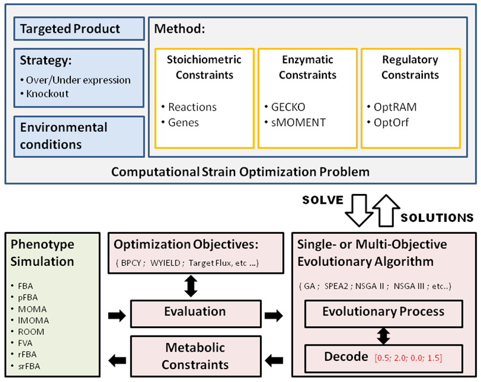

# Introduction
**Metabolic Engineering Workbench in python**

MEWpy is a Computational Strain Optimization (CSO) tool able to aggregate different types of constraint-based models and simulation approaches. It relies on Evolutionary Algorithms (EAs) to identify the set of genetic modifications that favor and optimize a desired metabolic engineering goal. One of the main advantages of EAs is to enable the simultaneous optimizations of more than one objectives (product rate, growth rate, number of modifications, etc.), sometimes conflicting,  and deliver in a single run a set of trade-off solutions between the objectives.

MEWPy currently supports [REFRAMED](<https://github.com/cdanielmachado/reframed>) and [COBRApy](<https://opencobra.github.io/cobrapy/>) phenotype simulators integrating both in a common API which enables different methods (FBA pFBA, ROOM, MOMA, lMOMA, rFBA, srFBA and FVA). The optimization engine relies on either [inspyred](<https://github.com/aarongarrett/inspyred>) or [jMetalPy](<https://github.com/jMetal/jMetalPy>) packages, which are used for creating biologically-inspired computational intelligence algorithms in Python. MEWPy requires a compatible solver for linear programming problems, with installed Python dependencies installed, from the following list:

* [CPLEX](<https://www-01.ibm.com/software/commerce/optimization/cplex-optimizer/>) (preferred)
* [GUROBI](<http://www.gurobi.com>)
* [GLPK](<https://www.gnu.org/software/glpk/>)
