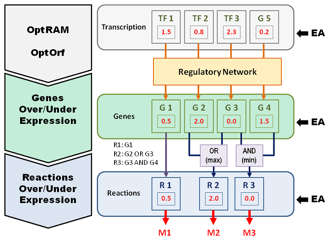
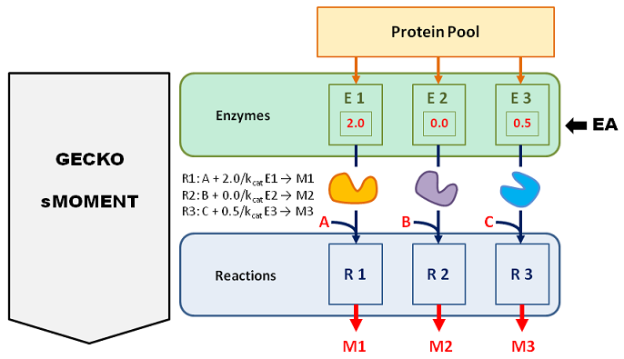

# Optimization Tasks

MEWpy is a Computational Optimization framework that uses Evolutionary Computation to solve Metabolic Engineering and Systems Biology problems. For example, MEWPY allows to find sets of metabolic modifications that favor a defined phenotypic objective, such as the production of targueted metabolites, optimize the composition of microbial communities, medium composition, or enzymes kinetic rates.  Optimization tasks are defined as optimization problems which encompass a metabolic model and optimization objectives. Additional arguments may be added depending on the problem specificities.

```python
problem = Problem(model,[f_obj_1, f_obj_2, f_obj_3],**kwargs)
```

## Optimization Engines

A problem may contemplate one or more optimization objectives. The number of objectives will determine the Evolutionary Algorithms best suited to solve problem. Single objective problems may be addressed using a Genetic Algorithm (GA) or Simulated Annealing (SA), problems with two objectives may be solved using the Non-sorting Genetic Algorithm (NSGA-II) or the Strength Pareto Evolutionary Algorithm (SPEA2),  while many objective problems, with three or more objectives, require the use of algorithms such as NSGA-III or the Hypervolume Estimation algorithm (HypE).

Invoking an EA to solve a defined optimization problem is a straight forward task as depicted in the following example:

```python
from mewpy.optimization import EA
ea = EA(problem, max_generations=100, algorithm='NSGAIII')
ea.run()
```

Presently, MEWpy uses optimization engines provided by Inspyred and JMetalPy packages. The last is preferred, not only because it is actively maintained, but also because it provides a broader set of EAs and tools.


## Strain Optimization Strategies and Methods

MEWpy supports different models, some integrating omic data, such as enzymatic expression (GECKO and sMOMENT models) others integrating regulatory networks. The availability of such models enables MEWpy to suggest modifications in distinct layers, targeting modifications on reaction fluxes, gene expression, enzyme availability, regulatory genes and transcription factors. Modifications follow two main strategies, notably,  deletions and over/under expression of targets.

### Reactions

**Deletion** on reactions fluxes are achieved by setting the reactions lower and upper bounds to 0.

**Under expressing**  a forward reaction consists on setting its flux upper bound to a value lesser to a reference flux value, while under expressing  a backward reaction flux consists on setting its lower bound to a value greater to the reference flux value.  For reversible reactions,  the reference flux direction sets the direction to be preserved, and the lower bound or upper bound is set to 0 if and respectively the reference flux direction is forward or backward.  Under expressing a reaction with no flux on the reference is equivalent to a deletion.

**Over expressing** a forward reaction consists on setting its flux lower bound to a value greater to the reference flux value, while over expressing  a backward reaction flux consists on setting its upper bound to a value lesser to the reference flux value.  Similarly to the under expression of reactions strategy,  the reference flux direction sets the direction to be preserved.

**Reference flux values** may be defined by a user or automatically computed by MEWpy. The last considers two strategies: 1) use the wild type flux distribution as reference or 2) perform a two step simulation process where deletions are firstly applied to derive a reference flux distribution which will be used to set the over/under regulations on a second step.

To configure a problem with a customized reference distribution, just pass the reference, a dictionary of reaction: value, as a problem parameter:

```python
problem = Problem(model, objectives, reference=reference)
```

To use the wild type flux distribution as reference, computed for the provided medium, set the `twostep` parameter to `False`:

```python
problem = Problem(model, objectives, envcond=medium, twostep=False)
```

The two step approach is applied by default by MEWpy.

### Genes

A combinatorial solution that over- or under expresses a set of genes is propagated to the catalyzed reactions converting transcription/translational information into constraints over the fluxes of the reactions (see Fig. 2). To that end, and taking as reference the flux distribution resulting from applying the deletions contained in the genetic modifications, the Boolean operators OR/AND in Gene-Protein-Reaction (GPR) rules are translated into functional operators  (by defaults MAX and MIN functions) asserting new reaction flux constraints.



Fig.2: *Propagation of gene expression values to constraints over reaction fluxes*.

As an example, lets suppose a reaction R has a GPR rule '(G1 or G2) and (G3)' associated to it.

```python
gpr = '(G1 or G2) and G3'
```

MEWpy converts the GPR rule into a parsing tree (using a Boolean syntax) that is later used for evaluation.

```python
from mewpy.util.parsing import build_tree, Boolean

tree = build_tree(gpr,Boolean)
```

The parsing can be visualized as prefix representation of the rule or as a tree:

```python
print(tree)
& ( | ( G1 , G2 ) , G3 )

tree.print_node()
|____[&]
         |____[|]
                 |____ G1
                 |____ G2
         |____ G3
```

To evaluate the **deletion** of a gene, for example G1, we define the list of *ON* genes, that is, G2 and G3, and instantiate a `BooleanEvaluator`.

```python
from mewpy.util.parsing import BooleanEvaluator
be = BooleanEvaluator(['G2','G3'])
tree.evaluate(be.f_operand, be.f_operator)

True
```

That is, there is no impact on the reaction if gene G1 is deleted.

Now lets suppose that the only *OFF* gene is G3:

```python
be = BooleanEvaluator(['G1','G2'])
tree.evaluate(be.f_operand, be.f_operator)

False
```

As expected, when deleting G3, the reaction R is knockout.

**Over or under expressing genes** fallows a similar process, but the Boolean operators are replaced with functions. To that end, we use a GeneEvaluator, identifying the functions to replace the [AND,OR] operators, as well as the genes expression:

```python
from mewpy.util.parsing import GeneEvaluator
# G1 and G3 are under expressed to half, and a quarter.
# G2 is over expressed to twice its expression value.
genes = {'G1':0.5,'G2':2,'G3':0.25}

# min replaces AND
# max replaces OR 
evaluator = GeneEvaluator(genes, min,max)    
```

 Now, let us evaluate the GPR rule for reaction R using the newly define *evaluator*:

```python
tree.evaluate(be.f_operand, be.f_operator)
0.25
```

That is, the reaction flux will be under expressed to 0.25 of the reference.

### Enzymes

Genome-Scale Metabolic Models, although being efficient in modeling an organism's gene-protein-reaction (GPR) interactions, are oblivious to other equally important factors (e.g. enzyme kinetics and abundance, Transcription Factors, signaling, etc.) which affect cells' metabolism and transcriptional regulation. The incorporation of such elements as additional constraints leads to better and more accurate phenotype prediction. GECKO (GSMM with enzymatic constraints using kinetic and omics data) and sMOMENT (short MetabOlic Modelling with ENzyme kineTics) models enhance GSMMs by imposing soft constraints as upper bounds on fluxes representing the overall enzyme usage. GEMs stoichiometric matrices are extended by adding new rows that represent the enzymes and new columns that represent each enzyme’s usage. Kinetic information is included, in each added row, as stoichiometric coefficients in the form of enzymes’ turnover (kcat) values. Also, an identity sub-matrix over the added rows and columns permits to model each enzyme usage upper bound, respecting therefore the constraints on each flux.

The computational strain optimization method performs modifications to the organism's metabolism by over- and under expressing protein values (see Fig. 3), which are reflected in the catalyzed reaction bounds. The optimization procedure, defined as in the previous sections, delivers solutions that reflect the over- or under expression of proteins whose usage is limited by enzyme upper bound constraints and by the protein pool inside the cell.



Fig.3 :*Protein over- and under expression.*

Kinetic models of metabolism may also be explored to engineer mutant strains. Indeed, modifications on maximum velocity parameters values can be explored as proxies for enzyme concentrations. MEWpy, makes availabe a set of kinetic optimization problems that enables the exploration of such strategies.

### Regulatory Networks

A metabolic model alone has a significant limitation in revealing condition-specific metabolic activity because gene regulation plays an important role in constraining the particular metabolism available under any given condition. Also, the complex cross-talking mechanisms between gene regulation and metabolism are not captured by a metabolic model alone. As such, methods that systematically integrate a transcriptional regulatory network and a metabolic network have been put forward, including Regulatory Flux Balance Analysis (RFBA), the Steady-state Regulatory FBA (SRFBA), Probabilistic Regulation of Metabolism (PROM), Integrated Deduced REgulation And Metabolism (IDREAM), and CoRegFlux.

Computational strain optimization has benefited from the integration of regulatory and metabolic networks, proposing more effective metabolic engineering strategies. OptORF is one of the earliest strategies which aims to identify the optimal metabolic and regulatory gene deletions as well as gene over-expression that maximize biochemical production at the maximum cellular growth under transcriptional regulatory constraints. OptORF is a bi-level optimization problem. While the inner problem maximizes growth under the given gene deletions, the regulatory states are determined by the constraints of the outer problem. One limitation of OptORF is that it is based on a mechanical (Boolean) representation of the regulatory network and therefore ignores the range of possible regulatory intensities between regulatory factors and the target genes. Also, Boolean networks can only suggest the manipulation of transcription factors by knockouts (ON to OFF) and cannot guide more quantitative adjustment of transcriptional regulation. Nonetheless, this strategy was included in MEWpy to enable a broader set of possible solutions. Regulatory rules are often complex and may include conditions. Next, we present an example of how MEWpy evaluates such a rule:

```python
# boolean example with conditions.
expression = "( (Lrp AND NOT (leu_L_e_>0)) OR NOT(((GlnG AND GlnB AND GlnD) AND RpoN) \
             AND ((glu_L_e_>0) OR (arg_L_e_>0) OR (asp_L_e_>0) OR (his_L_e_>0) OR (pro_L_e_>0) )))"
t = build_tree(expression, Boolean)
    
true_list = ['GlnG']
# dict of variables values
values = {'leu_L_e_': 1, 'glu_L_e_': 7, "arg_L_e_": 0.5, "asp_L_e_": 2, "his_L_e_": 0, "pro_L_e_": 0}
    
# propositions in the list are evaluated as True and the remaining as False.
evaluator = BooleanEvaluator(true_list, values)

res = t.evaluate(evaluator.f_operand, evaluator.f_operator)
```

```python
True
```

More recently, OptRAM (Optimization of Regulatory And Metabolic Networks) was developed as a novel strain design algorithm that can identify combinatorial optimization strategies including over-expression, knockdown or knockout of both metabolic genes and transcription factors. OptRAM is based on IDREAM integrated network framework, which makes it able to deduce a regulatory network from data. While the original OptRAM uses a single objective Simulated Annealing algorithm to explore the solution search space, the MEWpy implementation uses MOEAs which improves on the solution's diversity and convergence.
