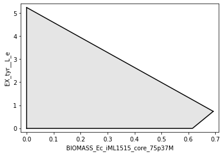

# Phenotype Simulation


## Loading metabolic models

Models can be loaded using REFRAMED or COBRApy:

```python
# using REFRAMED
from reframed.io.sbml import load_cbmodel
model = load_cbmodel('iML1515.xml',flavor='cobra')

# using COBRApy
from cobra.io import read_sbml_model
model = read_sbml_model('iML1515.xml')
```

In addition, our `mewpy.germ` module can be used to load metabolic models in SBML, JSON, COBRApy model or Reframed model formats. 
Consult the [documentation](https://mewpy.readthedocs.io/en/latest/germ.html#mewpy-phenotype-simulation-using-germ-models) 
for more information.

A simulator object provides a common interface to realize the main phenotype analysis tasks. The *get_simulator* function returns a simulator, a wrapper,  for the provided model. The simulator interface remains the same regardless of how the model was loaded, using REFRAMED or COBRApy. This simplify the use of both environments and ease the management of future changes and deprecation on their APIs.

```python
# build a phenotype simulator
from mewpy.simulation import get_simulator
simul = get_simulator(model)
```

The simulator offers a wide API, and enable to perform basic tasks, such as, list  metabolites, reactions, genes and compartments:

```python
simul.metabolites[:10]
```

```
['octapb_c',
 'cysi__L_e',
 'dhap_c',
 'prbatp_c',
 '10fthf_c',
 'btal_c',
 '6pgg_c',
 'co2_e',
 'akg_e',
 'gsn_e']
```

```python
simul.reactions[:10]
```

```
['CYTDK2',
 'XPPT',
 'HXPRT',
 'NDPK5',
 'SHK3Dr',
 'NDPK6',
 'NDPK8',
 'DHORTS',
 'OMPDC',
 'PYNP2r']
```

```
simul.genes[:10]
```

```
['b2551',
 'b0870',
 'b3368',
 'b2436',
 'b0008',
 'b3500',
 'b2465',
 'b0945',
 'b4467',
 'b3126']
```

```python
simul.compartments
```

```
{'c': 'cytosol', 'e': 'extracellular space', 'p': 'periplasm'}
```


MEWpy allows to search for specific metabolites, reactions or genes using regular expressions:

```
# find reactions identified with a term containing 'biomass'
simul.find('biomass')
# find metabolites identified with a term containing 'o2'
simul.find('o2',find_in='m')
```


A simulator may also be loaded considering environmental conditions, that will be considered during phenotype simulations. In the next example, glucose consumption is limited to 10 mmol/gDW/h while oxygen is set to unlimited.

```python
# environmental conditions
envcond = {'EX_glc__D_e': (-10.0, 100000.0),
           'EX_o2_e':(-1000,1000)}

simul = get_simulator(model,envcond=envcond)
```

All phenotype simulations will consider the imposed environmental conditions, and as such they only need to be set once. Also, these conditions do not persistently alter the model, which can be reused with a different simulator instance.   


## Phenotype simulation

Phenotype simulations are also run using the simulator instance using  the `simulate` method. 

```python
# FBA 
result = simul.simulate()
# or 
result = simul.simulate(method='FBA')
```

```
objective: 0.8769972144269748
Status: OPTIMAL
```

Flux Balance Analysis (FBA) can be run without identifying any method, or  by passing the 'FBA' as method parameter. Other phenotype simulation methods may also be run using one of the identifiers:

- Flux Balance Analysis: `method = 'FBA'`
- Parsimonious FBA:`method = 'pFBA'`
- Minimization of Metabolic Adjustment:`method = 'MOMA'`
- Linear MOMA: `method = 'lMOMA'`
- Regulatory on/off minimization of metabolic flux: `method = 'ROOM'`

```python
# pFBA
result = simul.simulate(method = 'pFBA')
```

```
objective: 769.7902399146501
Status: OPTIMAL
```


## Reaction fluxes

The phenotype simulation result object, besides containing the objective value and solver status, also include reaction fluxes in the form of a dictionary:

```python
result.fluxes 
```

```
OrderedDict([('CYTDK2', 0.0),
             ('XPPT', 0.0),
             ('HXPRT', 0.0),
             ('NDPK5', 0.0),
             ('SHK3Dr', 0.33424030136519417),
             ('NDPK6', 0.0),
             ('NDPK8', 0.0),
             ...])
```

It is also to possible to retrieve reaction fluxes in the form of a data frame:

```python
result.dataframe
# or using find to list specific fluxes ordered by their values
result.find('glc|biomass', sorted=True)
```

```
        Reaction ID 	Flux
0       CYTDK2  0.00000
1       XPPT    0.00000
2       HXPRT   0.00000
3       NDPK5   0.00000
4       SHK3Dr  0.33424
... 	...     ...
2707    MPTS    0.00000
2708    MOCOS   0.00000
2709    BMOGDS2 0.00000
2710    FESD2s  0.00000
2711    OCTNLL  0.00000

2712 rows × 2 columns
```

Individual reaction flux values can be obtained from the dictionary representation. For example, the *Prephenate dehydratase* reaction flux can be obtained from the previous pFBA simulation using the reaction identifier:

```python
result.fluxes['PPNDH']
0.16247688893081344
```


## Retrieving and setting the model objective

The simulation objective, when running FBA or pFBA phenotype simulations, is, by default, the model objective which can be seen using the simulator.

```python
simul.objective
```

```python
{'BIOMASS_Ec_iML1515_core_75p37M': 1.0}
```

The simulator may also be used to change the model objective, for example, to optimize the ATP maintenance requirement (ATPM):

```python
simul.objective = 'ATPM'
# or
simul.objective = {'ATPM':1}
```

The last enables to define objectives as linear expressions where the dictionary values are the expression coefficients.


## Adding additional constraints to phenotype simulations

Simulations may include additional metabolic constraints on reaction fluxes. From the previous pFBA simulation one can observe that the organism does not produce L-tyrosine:

```python
simul.objective = 'BIOMASS_Ec_iML1515_core_75p37M'
```

```python
result.fluxes['EX_tyr__L_e']
0.0
```

Additional constraints may be added to the model so that the organism start to  produce this aromatic amino acid. We may alter, for example, the *3-dehydroquinate dehydratase* reaction bounds, among others, starting by verifying its initial bounds:

```python
# initial bounds
simul.get_reaction_bounds('DHQTi')
(0.0, 1000.0)
```

```python
# additional constraint
constraints = {'DHQTi' : (1, 10000),
               'PPC'   : (16.791619483918264, 10000),
               'FADRx2': (0, 0.0),
               'PDH'   : (0, 0)}

# run a pFBA simulation accounting with the new constraint
result = simul.simulate(method='pFBA',constraints=constraints)

result.fluxes['EX_tyr__L_e']
0.7362937237983241
```

We also need to verify that the organism continues to grow:

```python
res.fluxes['BIOMASS_Ec_iML1515_core_75p37M']
0.691926343744802
```

It is also possible to plot the production envelope:

```python
from mewpy.visualization.envelope import plot_flux_envelope
plot_flux_envelope(simul,'BIOMASS_Ec_iML1515_core_75p37M','EX_tyr__L_e',constraints = constraints)
```



The `simulate` method includes additional parameters, such as the optimization direction. For a full description please refer to the module documentation. 


## Flux Variability Analysis

The simulator interface also allows to perform Flux Variability Analysis (FVA) for L-tyrosine, returning a dictionary:

```python
simul.FVA(reactions=['EX_tyr__L_e'])
{'EX_tyr__L_e': [0.0, 0.5721226993865252]}
```

or a data frame:

```python
simul.FVA(reactions=['EX_tyr__L_e'], format='df')
```

```
 	Reaction ID 	Minimum 	Maximum
0 	EX_tyr__L_e 	0.0 		0.572123
```


By default, MEWpy sets the model objective fraction to 90%, however this fraction may be altered. For example, one might want to consider a fraction of 10% from optimal growth:

```python
simul.FVA(reactions=['EX_tyr__L_e'], obj_frac=0.1)
{'EX_tyr__L_e': [0.0, 5.086103322262054]}
```

The FVA simulations are run considering the defined environmental conditions. Additional constraints may be added, or changed, such as the ones previously used. 

```python
simul.FVA(reactions=['EX_tyr__L_e'], constraints=constraints)
{'EX_tyr__L_e': [0.0, 1.1883110320942545]}
```

 COBRApy users may have noticed that this same task would have required many additional coding lines if using the COBRApy API directly.

## Genes and reactions essentiality

Gene and reaction essentiality tests identify , respectively, the list of genes and reactions whose deletion would prevent the organism to grow. 

```python
simul.essential_reactions()
['SHK3Dr',
 'DHORTS',
 'OMPDC',
 'G5SD',
 'CS',
 'ICDHyr',
 'PPA',
 'APRAUR',
 'DB4PS',
 'ALAR',
 'RBFK',
 'ASPTA',
 ...]
```

```python
simul.essential_genes()
['b3368',
 'b1260',
 'b0109',
 'b1094',
 'b2472',
 'b1261',
 'b3770',
 'b0243',
 'b0414',
 'b3041',
 'b0025',
 'b1662',
 'b0421',
  ...]
```


